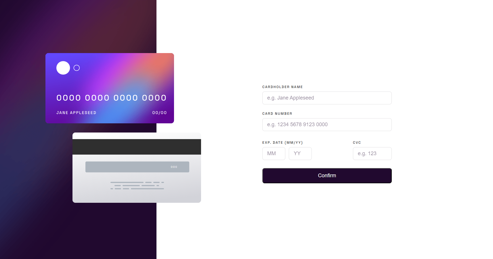
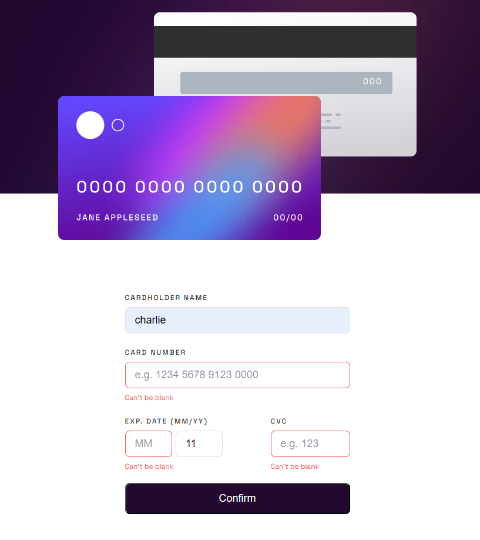
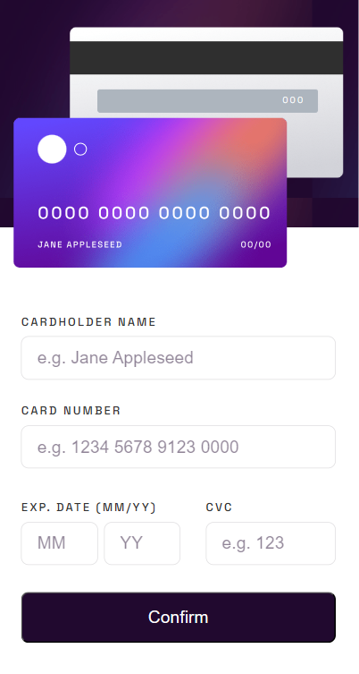
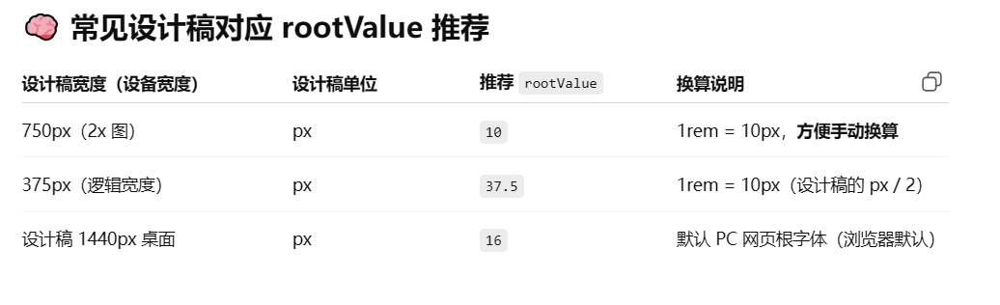

# intro

- 填写信用卡信息，包含空值、数字验证，提交后，跳转到成功的页面
  
  
  
  

# 1. What are you most proud of?（学到了什么？）

- 提高熟练度，但是还有一些细节和未解决的问题

# 2. What challenges did you encounter, and how did you overcome them?（曾遇到和解决了什么问题？）

- CSS border-color 不支持渐变（linear-gradient(...)）作为值。
  border: 2px solid transparent; /_ 边框必须设置为 transparent _/
  border-image: linear-gradient(to bottom right, #6348fe, #610595);
  border-image-slice: 1;
- CSS input 边框，凹凸样式，如何去掉？
  border-style:solid;
- CSS：Can't be blank 的 span 的间距问题
  span 是默认为 inline-block（会延续和上面一行的边距），改为 block 就可以了
- hover: 移动端没有鼠标悬浮
- active:移动和桌面都有

- JS,form 的 input 的取值， const formData = new FormData(form);注意是 name 的属性值，要加上 name；
- 表单提交后，跳转到完成页面，应该怎么写逻辑呀？应该用元素 display 去控制显示与否;

- 手机优先：
  vw、rem 流动的字号，单列;
  尽量写宽度和居中对齐，不要写 padding；
- 大屏增强：  
  断点；
  平板和桌面要固定字号； html {font-size: 37.5px !important; }
  响应式布局：（flex/grid/media query 控制几列、间距、边距、水平居中 margin: 0 auto;）
  适配和响应式：注意电脑屏幕分辨率、缩放；浏览器的缩放；
  

# 3. What would you do differently next time?（下次有什么改进？待解决的问题）

- border-image 不支持与 border-radius 直接协同渲染圆角效果 —— 渐变边框会强行拉直贴边，而不遵循圆角曲线。
- 表单验证，名字只能是字母，数字的位数
