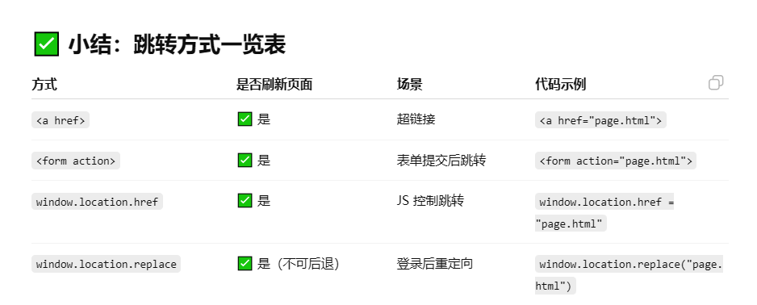

# 1. What are you most proud of?（学到了什么？）

- balabala

# 2. What challenges did you encounter, and how did you overcome them?（曾遇到和解决了什么问题？）

- CSS border-color 不支持渐变（linear-gradient(...)）作为值。
  border: 2px solid transparent; /_ 边框必须设置为 transparent _/
  border-image: linear-gradient(to bottom right, #6348fe, #610595);
  border-image-slice: 1;

- CSS input 边框，凹凸样式，如何去掉？
  border-style:solid;
- CSS：Can't be blank 的 span 的间距问题
  span 是默认为 inline-block（会延续和上面一行的边距），改为 block 就可以了

- JS,form 的 input 的取值， const formData = new FormData(form);注意是 name 的属性值，要加上 name；

# 3. What would you do differently next time?（下次有什么改进？待解决的问题）

- 鼠标悬停 hover，在输入框和按钮，都无法实现，cursor：pointer？？？
- JS: month 和 year 公用一个错误提示的问题；
- border-image 不支持与 border-radius 直接协同渲染圆角效果 —— 渐变边框会强行拉直贴边，而不遵循圆角曲线。
- input type="number" 的行为
  非数字会被清除：有时输入 1e 或 1-，离开焦点后会自动清空或无法提交。
- 表单提交后，跳转到完成页面，应该怎么写逻辑呀？无跳转…

- 完成了移动web适配，但是大屏增强,写得不太顺利
- 桌面的按钮，会挤压在一起……

